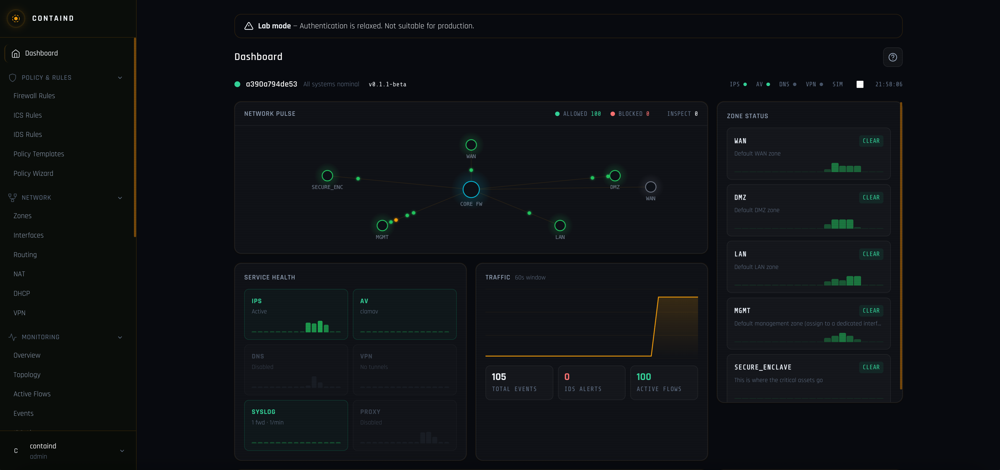

# containd

[](https://github.com/tonylturner/containd/actions/workflows/ci.yml)
[](https://github.com/tonylturner/containd/actions/workflows/release.yml)
[](https://go.dev/)
[](LICENSE)
[](https://github.com/tonylturner/containd/releases)
[](https://github.com/tonylturner/containd/pkgs/container/containd)
[](https://github.com/tonylturner/containd/releases)
[](https://github.com/tonylturner/containd/actions/workflows/ci.yml)
[](https://github.com/tonylturner/containd/actions/workflows/release.yml)
[](https://github.com/topics/ot-security)
[](https://www.cisa.gov/securebydesign)

**Segment your ICS network in minutes, not months.**

An open-source next-generation firewall purpose-built for ICS/OT network segmentation. containd is a single-container appliance that combines zone-based firewalling, ICS protocol deep packet inspection, embedded network services, and a full management UI. Designed for industrial control system operators who need OT-aware security without assembling dozens of point tools.

## Quick Start

```bash
curl -O https://raw.githubusercontent.com/tonylturner/containd/main/deploy/docker-compose.yml
CONTAIND_JWT_SECRET=$(openssl rand -hex 32) docker compose up -d
```

| Service | URL |
|---------|-----|
| Web UI / API | `http://localhost:8080` |
| HTTPS | `https://localhost:8443` |
| SSH console | `ssh -p 2222 containd@localhost` |

Default credentials: `containd` / `containd` -- change on first login.

<p align="center">
  
  <br />
  <em>Dashboard with live network topology, service health, traffic pulse, and zone status</em>
</p>

## Why containd?

Traditional IT firewalls don't understand ICS protocols. They can't distinguish a legitimate Modbus register read from a malicious write, or detect anomalous DNP3 function codes. OT environments need protocol-aware segmentation, but deploying and integrating separate tools for firewalling, DPI, IDS, asset inventory, and network services is complex and fragile. containd puts all of this in a single container with one config model and one UI.

## What It Does

**Firewall** -- Zone-based with nftables enforcement, NAT (SNAT + DNAT), default-deny posture, and optional eBPF XDP/TC acceleration.

**ICS/OT Deep Packet Inspection** -- Native Go decoders for Modbus, DNP3, CIP/EtherNet/IP, S7comm, IEC 61850 MMS, BACnet, OPC UA, plus DNS, TLS/JA3, HTTP, SSH, RDP, SMB, SNMP, NTP. Per-protocol enable/disable, learn-then-enforce workflow, function code and register-level visibility.

**ICS Security** -- Asset auto-discovery from traffic, learn mode for auto-generating allowlist rules, protocol anomaly detection, built-in ICS malware signatures, Sigma-compatible IDS rules, PCAP offline analysis.

**Embedded Services** -- DNS (Unbound), NTP (OpenNTPD), DHCP, forward proxy (Envoy), reverse proxy (Nginx), VPN (WireGuard + OpenVPN), antivirus (ClamAV via ICAP).

**Management** -- Web UI with dashboard, topology, firewall rules, routing, NAT, services, monitoring, and diagnostics. SSH console with appliance-style CLI. REST API, Prometheus metrics, syslog forwarding, event export (CEF/JSON/Syslog).

**Config Lifecycle** -- Candidate/running configs with commit-confirmed and auto-rollback, deterministic JSON export/import, schedule and identity predicates on rules, ICS policy templates for rapid deployment.

## Architecture

Single Go binary, three logical planes:

- **Data plane** -- nftables/conntrack, NFQUEUE selective DPI steering, TCP reassembly, per-flow verdict caching, IDS/IPS
- **Control plane** -- SQLite persistence, policy compilation, service management, audit logging
- **Management plane** -- REST API, web UI, SSH console, auth/RBAC

Run modes: `containd all` (combined), `containd mgmt`, `containd engine`.

## Lab Topology

The dev compose file (`deploy/docker-compose.dev.yml`) creates 8 isolated networks for development:

| Network | Subnet | Interface |
|---------|--------|-----------|
| WAN | 192.168.240.0/24 | eth0 |
| DMZ | 192.168.241.0/24 | eth1 |
| LAN1 | 192.168.242.0/24 | eth2 |
| LAN2 | 192.168.243.0/24 | eth3 |
| LAN3 | 192.168.244.0/24 | eth4 |
| LAN4 | 192.168.245.0/24 | eth5 |
| LAN5 | 192.168.246.0/24 | eth6 |
| LAN6 | 192.168.247.0/24 | eth7 |

## Standalone Container

```bash
docker run -d \
  --name containd \
  --cap-add NET_ADMIN --cap-add NET_RAW \
  -p 8080:8080 -p 8443:8443 -p 2222:2222 \
  -v containd-data:/data \
  -e CONTAIND_JWT_SECRET=$(openssl rand -hex 32) \
  ghcr.io/tonylturner/containd:latest
```

## From Source

```bash
go build -o containd ./cmd/containd
cd ui && npm ci && npm run build && cd ..
CONTAIND_UI_DIR=ui/out ./containd all
```

## Security

- Default-deny firewall posture
- Distroless container image, nonroot
- JWT auth with session invalidation, admin/view-only roles, MustChangePassword on first login
- TLS 1.2+ with hardened cipher suites, HSTS enabled by default
- CORS wildcard rejection, SameSite=Strict cookies, path traversal protection
- Rate limiting on auth endpoints, nftables injection prevention
- Cosign-signed container images with CycloneDX SBOM attestation
- Trivy vulnerability scanning in CI (zero HIGH/CRITICAL)

See [SECURITY.md](SECURITY.md) for production hardening and vulnerability reporting.

## Documentation

Full docs are embedded in the appliance (Help icon in UI) and built from `docs/mkdocs/`:

- [Architecture](docs/mkdocs/architecture.md) | [Dataplane](docs/mkdocs/dataplane.md) | [eBPF](docs/mkdocs/ebpf.md)
- [Docker Compose Deployment](docs/mkdocs/docker-compose.md) | [Host Deploy](docs/mkdocs/deploy-host.md)
- [CLI Reference](docs/mkdocs/cli.md) | [Config Format](docs/mkdocs/config-format.md)
- [ICS DPI](docs/mkdocs/ics-dpi.md) | [IDS Rules](docs/mkdocs/ids-rules.md) | [Policy Model](docs/mkdocs/policy-model.md)
- [Services](docs/mkdocs/services.md) | [API Reference](docs/mkdocs/api-reference.md)
- [SBOM](docs/mkdocs/sbom.md) | [Third-Party Licenses](docs/mkdocs/SPDX.md)

[OpenAPI 3.0 specification](docs/openapi.yaml) for the REST API.

## Contributing

Contributions welcome -- ICS protocol decoders, policy templates, documentation, and bug reports are all valuable. See [CONTRIBUTING.md](CONTRIBUTING.md).

## License

Apache License 2.0 -- see [LICENSE](LICENSE).
